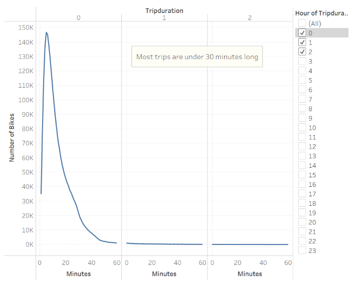

# NYC Bikesharing Usage

## Overview

The purpose of this project is to analyse data from a bikesharing service in New York City, identifying who are their customers and how they use this service. This study will be used to replicate the business model in another location. Python, Pandas, and Jupyter notebooks were used for data cleansing. The visualisations were created in Tableau and can be accessed through this link [NYC Bikesharing Usage](https://public.tableau.com/app/profile/carolina.semerano/viz/Bikesharing_challenge_16548203401410/NYCBikesharingUsage?publish=yes).

## Results

- Customers Breakdown: This pie chart shows that 81% of users are subscribers, which indicates a steady clientele able to ensure the service is viable.

- User type demographics: This dashboard contains two graphs. The pie chart shows the breakdown of customers by gender, showing that 65% of users are male. The line chart presents users by birth year. This particular view is filtered to show only information about subscribers since they are the major group of users. It is possible to notice that the majority of subscribers were born between 1980 and the early 1990s, corresponding to the Millenial generation.

- Trip duration: The vast majority of trips are no longer than 30 minutes.

- Trip duration by gender: Breaking down by gender, there is no relevant difference in trip duration. However, we can notice a significantly higher amount of rides by male users.

- User trips by gender: Again, it is evident the higher concentration of rides by male subscribers. Special attention to weekdays with a higher amount of rides, Thursdays and Fridays.

- Trips by Weekday: Breaking down trips by weekday and hour, it is possible to notice peaks early in the morning and in the evening on workdays consistent with office hours. That is strong evidence that bikesharing has been used to commute. Still, the number of trips on weekends suggests that bikesharing is also used for leisure.

- Trips by gender (Hour): Considering gender, we can observe the same usage pattern among male and female users, even though trips by male users outnumber the other groups. However, when there is no information about gender, trips are concentrated on weekends, which suggests leisure and occasional users.

## Summary

In conclusion, to replicate the success of bikesharing in NYC, the service should be targeting male Millenials as subscribers, who may be interested in replacing their traditional commute for cycling. This core group will ensure viability, while other groups may be targeted as occasional customers, such as families and teens. Other metrics that might be considered in future analyses are the bikes available by the number of users, bikes available by location, and trips by location.